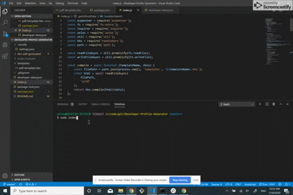
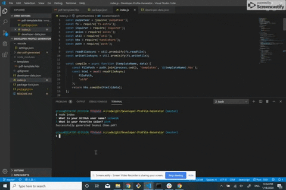

# Developer-Profile-Generator
A command-line application that dynamically generates a PDF profile from a GitHub username :octocat:
 
It prompts user's favorite color to effectively format the pdf!

# Screenshots

</a>

# Tech/framework used
* Programming Languages: JavaScript, HTML, CSS
* CSS Framework: Bootstrap 4
* Platform: Node.js, npm
* Library/Package: Puppeteer, Handlebars, Axios, Inquirer, Fs-extra
* Other tools: Git, Visual Studio Code, Font Awesome, Google Fonts

# Setup
To run this project:
1. Clone to your computer :computer:
<pre> git clone https://github.com/schoe14/Developer-Profile-Generator.git </pre>
2. Install packages :star2:
<pre> npm install </pre>
3. Command :+1:
<pre> node index </pre>